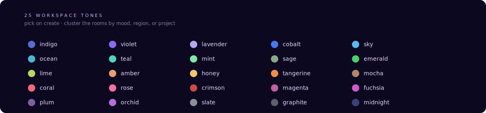

<div align="center">


&nbsp;

<a href="https://github.com/AllStreets/ONEXUS/releases/tag/v1.0"></a>
<a href="https://github.com/AllStreets/ONEXUS/actions"></a>
<a href="https://github.com/AllStreets/ONEXUS-Agents"></a>
<a href="https://github.com/AllStreets/ONEXUS-Agents"></a>
<a href="https://github.com/AllStreets/ONEXUS/blob/main/LICENSE"></a>

&nbsp;

<a href="#quickstart"><kbd> &nbsp; <strong>Quickstart</strong> &nbsp; </kbd></a> &nbsp;
<a href="#the-shell"><kbd> &nbsp; <strong>The Shell</strong> &nbsp; </kbd></a> &nbsp;
<a href="#the-safety-model"><kbd> &nbsp; <strong>Safety</strong> &nbsp; </kbd></a> &nbsp;
<a href="#built-in-agents"><kbd> &nbsp; <strong>Agents</strong> &nbsp; </kbd></a> &nbsp;
<a href="#deploy"><kbd> &nbsp; <strong>Deploy</strong> &nbsp; </kbd></a> &nbsp;
<a href="https://github.com/AllStreets/ONEXUS-Agents"><kbd> &nbsp; <strong>Agents catalog ↗</strong> &nbsp; </kbd></a>

</div>

---

<p align="center">
  
</p>

<p align="center"><em>One process. Local-first. Five-component kernel. Every tool call gated by Aegis. Every event logged to Chronicle. The kernel never touches the network — there's a static test that proves it.</em></p>

---

## What this is

**ONEXUS runs agents the way iOS runs apps.** Built-in cognitive modules (Council, Specter, Wraith, Echo, Oracle, Legacy, Consciousness, Sentry, Autonomic, Agents-dispatcher) and **6,745 third-party agents** from [ONEXUS-Agents](https://github.com/AllStreets/ONEXUS-Agents) — **571 with MCP adapters** — share one runtime, one manifest, one trust model, one set of surfaces.

A workspace is a room: it owns its own agents, memory, file grants, and home tone. Every tool call routes through a **capability arbiter** that gates against the agent's declared permissions, surfaces a first-use prompt when something needs your approval, and writes every byte to an immutable audit ledger.

You don't leave the OS to do anything. Code editor, web search, file drop, mood-driven atmosphere, agent capability sheets — all in-shell.

---

## Quickstart

> **Prerequisites:** Python 3.11+, [Ollama](https://ollama.com) (for natural-language responses — see next section), and ~6 GB free disk if you want a local LLM.

```bash
# 1. Clone ONEXUS + the agent catalog as siblings (the kernel looks for
#    ../ONEXUS-Agents/ for the 8,000+ catalog agents).
git clone https://github.com/AllStreets/ONEXUS.git
git clone https://github.com/AllStreets/ONEXUS-Agents.git
cd ONEXUS

# 2. Install the kernel + Aurora into a fresh venv.
python -m venv .venv && source .venv/bin/activate
pip install -e ".[llm,api,tui,messaging]"

# 3. Boot — single command brings up API + Aurora + WebSocket streams.
onexus serve --port 8765
```

Open **http://127.0.0.1:8765/aurora** and you're in. Every new install lands you in a default `Hello World` workspace; create more with `⌘N`, delete from the sidebar trash. First-time visitors also get a **13-page guided tour**; hit `?` any time to re-open it.

**Heads-up — without a local LLM (next section) agents only respond to pattern-matched commands** (`summon X`, `list`, `agents <keyword>`). Plain-English questions return a keyword-search dump instead of a real recommendation. Install Ollama and the same questions get LLM-backed answers.

### Local LLM (recommended — keeps you sovereign + offline)

The kernel ships with **Ollama** as the default inference provider. Install it once and ONEXUS picks it up automatically — no API keys, no outbound traffic, no rate limits.

```bash
# macOS
brew install --cask ollama         # or grab the .dmg from ollama.com
ollama serve &                      # daemon on localhost:11434
ollama pull llama3.1:8b             # ~5 GB · M-series default
# Smaller models that still work well:
#   ollama pull llama3.2:3b         # ~2 GB · 8 GB Macs
#   ollama pull qwen2.5:14b         # ~9 GB · better reasoning
```

ONEXUS auto-detects Ollama at boot — the Cortex routes natural-language questions through it, every catalog agent gets the LLM in its context, and Aegis still gates every tool call. No knobs to flip.

### Cloud provider (optional override)

Two ways to add an OpenAI or Anthropic key:

**In-app (recommended)** — Settings → Providers → CLOUD → click `+ add OpenAI API key` or `+ add Anthropic API key`. Paste the key, press Enter. It's stored at `~/.local/share/nexus/provider_keys.json` with `chmod 0600`, registered with the live kernel router immediately (no restart), re-displayed only as a tail-fingerprint like `sk-…1234`. Remove any time from the same row.

**Environment variables** — still respected, useful for CI / Docker:

```bash
export NEXUS_OPENAI_KEY=sk-...
# or
export NEXUS_ANTHROPIC_KEY=sk-ant-...
export NEXUS_DEFAULT_PROVIDER=openai   # or anthropic / local / ollama
```

### Keyboard shortcuts

```
⌘K   workspace switcher           ⌘E   workshop (code + sandbox)
⌘N   new workspace                ⌘/   web search
⌘L   cortex multi-agent launch    ⌘P   settings
⌘0   expanded cockpit              ?   open the guide
⌘⏎   send message
```

In the home composer you can also type `cortex <prompt>` — the keyword is detected and you're routed to the launcher with the rest of the message pre-filled.

Full keyboard + CLI + curl reference: **[docs/CHEATSHEET.md](docs/CHEATSHEET.md)**.

### Footprint

| Component | Disk | RAM |
|---|---|---|
| Cloned repo (no build) | ~20 MB | — |
| Python kernel + Aurora server | — | ~100 MB |
| Standalone `.app` (Tauri shell) | 12 MB | ~150 MB (WebView2 / WKWebView) |
| Ollama daemon | 550 MB | ~60 MB |
| `llama3.1:8b` model loaded | 5 GB | **6–10 GB** (default 8k context) |
| `llama3.2:3b` model loaded | 2 GB | **3–4 GB** |

**Practical minimum**: 8 GB Mac with `llama3.2:3b` and the cockpit-only build; **comfortable**: 16 GB with `llama3.1:8b`; **headroom**: 32 GB+ for larger models and big context windows.

---

## What it does, in four pictures

The whole shell **shifts color with what's happening**. Aegis observes the kernel — CPU, engram activity, trust events, time of day — and the ambient mesh, the active workspace pill, the composer focus ring, the launch buttons, the capability sheet edge **all recolor together**.

<table>
<tr>
<td width="50%"></td>
<td width="50%"></td>
</tr>
<tr>
<td align="center"><strong>calm focus</strong> · violet · default, low load</td>
<td align="center"><strong>creative</strong> · vivid navy · open-ended ideation</td>
</tr>
<tr>
<td width="50%"></td>
<td width="50%"></td>
</tr>
<tr>
<td align="center"><strong>deep flow</strong> · jewel green · long uninterrupted stretches</td>
<td align="center"><strong>alert</strong> · crimson · trust collapse or denied call</td>
</tr>
</table>

Eight palettes total: calm focus · deep flow · routing · deliberating · creative · reflective · watchful · alert. Pick one manually from the chrome's mood pill, or let the kernel pick from observations.

---

## The shell

Aurora is a **persistent three-column workspace** — sidebar, conversation, cockpit. Glass chrome. macOS-style traffic lights that actually work (red closes the tab, yellow toggles focus mode, green toggles fullscreen).

<details>
<summary><strong>Sidebar</strong> — workspaces, recent agents, in-OS tools, user footer</summary>

- Workspace pills with **25 color tones** to pick from on create:

  

- Hover any pill → reveals a neon-red trash icon to delete that workspace
- Recent agents block — built-in identity discs with trust tier
- Workspace tiles show **live agent counts** — "agents · N" reflects distinct cortex modules you've actually chatted with in that workspace (sourced from chronicle, not just declared residents)
- `⌘L` cortex launch · `⌘E` workshop · `⌘/` web search · catalog · `⌘P` settings
- Persistent user footer pinned at the bottom

</details>

<details>
<summary><strong>Conversation</strong> — the talk surface</summary>

- Send a message and **Cortex routes** it: pattern + semantic + structure + workspace pin + LLM fallback
- `@oracle`, `@specter`, `@council` mention any agent directly
- Drag-and-drop files anywhere on the canvas — they're stored in workspace Engram, hashed for dedup, logged to Chronicle
- Inline permission prompts for sensitive calls: allow once · always · here · deny
- Trust feedback buttons under every agent response: thumb-up = +0.12 to that agent's trust; thumb-down = −0.22
- File diff cards when an agent proposes a refactor
- Composer pinned at the bottom regardless of thread length

</details>

<details>
<summary><strong>Cockpit rail</strong> — live observability</summary>

- **TRUST · last 60 minutes** — sparkline + delta + class breakdown (routine / notable / sensitive / denied)
- **Recent permissions** — color-coded by class, with capability + target + status + time
- **Ambient mood** — mood mesh thumbnail with the kernel's current reading and contributing reasons
- **Built-in agents** — 10 identity discs, click any for the full capability sheet
- Footer: `kernel.network.io = ∅ (static-verified)` — the kernel itself never touches the network

Press <kbd>⌘ 0</kbd> for the expanded six-panel cockpit overlay.

</details>

<details>
<summary><strong>Cortex launcher</strong> — fan one prompt out to many agents</summary>

`⌘L` (or sidebar → **cortex launch**, or type `cortex <prompt>` into the home composer) opens a multi-agent dispatcher:

- Big prompt textarea
- Every registered agent shows up as a chip — Cortex's classifier top-picks are visually marked, the primary pick gets a `PRIMARY` pill so you know which one Cortex would have routed to alone
- Shortcuts: `pick top 3 for me` · `all available` · `clear`
- Dispatch runs all selected agents in **parallel** via `asyncio.gather`. Each gets its own Aegis capability check, so a denied agent fails with a clear `permission_denied` row instead of crashing the run.
- Every run renders as its own card with module · ok/error pill · latency · full response
- All `multi_launch_start` / `multi_launch_done` / per-run events land in Chronicle, so the chat-history tab picks up multi-agent sessions automatically

</details>

<details>
<summary><strong>Settings</strong> — General · Chat history · Security · Providers · Federation · Moods · About</summary>

- **General** — data dir, port, default provider
- **Chat history** — drill from workspaces → agents → individual chats with full transcripts. 50 chats per page with prev/next pagination, polls every 5s so new exchanges appear without a refresh. Each workspace's chat cards pick up that workspace's own tone gradient on the left rail.
- **Security** — search any of the **590** Aegis-registered modules; revoke any agent's trust to 0 with one click
- **Providers** — LOCAL section (Ollama + llama.cpp with live health dots, green for healthy / red for unavailable) and CLOUD section (`+ add OpenAI / Anthropic API key` flow described above)
- **Federation** — peer-to-peer instance config
- **Moods** — current MoodEngine state + 8 atmospheres with live previews
- **About** — version, test count, catalog size, source link

</details>

---

## The safety model

Aegis classifies every capability into one of four classes:

| Class | Color | Behavior |
|---|---|---|
| **Routine** | jewel green | always allowed, silent forever |
| **Notable** | calm violet-blue | auto-allow at trust ≥ 0.75, otherwise prompt |
| **Sensitive** | warm amber | always prompt — allow once / always here / deny |
| **Privileged** | coral | never auto-grant — Settings → Security only |

<p align="center">
  
</p>

The kernel writes every decision to **Chronicle** (immutable append-only sqlite). The Aurora cockpit log surfaces the last N entries by class. Settings → Security shows the live trust roster — search any of the **590** Aegis-registered modules, click revoke to reset trust to 0.

---

## Built-in agents

Ten cognitive modules ship with ONEXUS. Each declares its own capabilities and trust floor.

| Agent | Glyph | What it does |
|---|---|---|
| **Council** | compass | 3-round deliberation across the cognitive modules |
| **Oracle** | eye | first-read analysis across whatever's in the workspace |
| **Specter** | warning triangle | red-team — counter-arguments and dissenting views, no flattery |
| **Wraith** | wisp | controlled forgetting — privacy hygiene, sensitive deletion |
| **Legacy** | open book | crystallized memory — recall with citations |
| **Echo** | nested arcs | mirror — restates the user's words to surface contradictions |
| **Sentry** | heartbeat | watches for runaway loops, trust drops, denied calls |
| **Autonomic** | concentric rings | autopilot — repeats approved tool chains hands-off |
| **Consciousness** | spiral | inner state — moods, regulation, salience |
| **Agents-dispatcher** | tile grid | routes to installed third-party MCP agents |

Click any disc in the cockpit to see its declared tools, permission classes, trust floor, and network reach.

---

## Architecture

<p align="center">
  
</p>

**The kernel never touches the network.** Every outbound HTTP request from any built-in module goes through `aegis.network()` which logs to Chronicle, checks the agent's `net.*` capability declaration, and runs through `AegisTransport` (a wrapped httpx client). A static invariant test enforces that no kernel module other than `aegis.py` imports `httpx` or `requests`.

---

## In-OS tools

You don't leave the OS to write code, search the web, or store files.

### Workshop · code + sandbox

Open with `⌘E`. Pick a runtime (Python · JavaScript · shell). Hit Run (`⌘⏎`). Code executes in a **subprocess sandbox**: stripped env (`ONEXUS_SANDBOX=1`), 8-second timeout, captured stdout/stderr (max 32 KB per stream), exit code + elapsed time, logged to Chronicle. History popover keeps the last 30 runs — click to reload, clear to wipe.

### Web search

Open with `⌘/`. Routes through `aegis.network()` to DuckDuckGo's instant-answer API by default (no tracking). Configure `NEXUS_BRAVE_KEY` to use Brave Search for organic results. Wikipedia is always a fallback so you never see an empty page. History popover with last 50 queries.

### File drop

Drag any file anywhere on the conversation canvas — the surface gets a mood-tinted "Drop files into this workspace" overlay. Files are stored under `<workspace_root>/.onexus/uploads/`, hashed for dedup, registered with Engram episodic memory, logged to Chronicle.

---

## Catalog

ONEXUS ships with the [AllStreets/ONEXUS-Agents](https://github.com/AllStreets/ONEXUS-Agents) catalog bundled — every entry is a single JSON manifest under `catalog/<category>/<slug>.json`. **6,745 agents** across 40 categories, **571 runnable** via MCP adapters. Browse from the sidebar's *agent catalog* link, filter by category / runnable-only / search, click Launch on any runnable card.

The catalog rebuilds nightly via a [GitHub Actions cron](.github/workflows/nightly-catalog.yml) that reads the catalog repo's head SHA and pushes a fresh Docker image to GHCR.

---

## Deploy

### Local

```bash
onexus serve --port 8765
```

Open `http://127.0.0.1:8765/aurora`. Data lives in `~/.local/share/nexus/`.

### Standalone `.app` (Tauri wrapper)

ONEXUS ships with a native desktop shell — a 12 MB Tauri binary that hosts the Aurora UI in a host WebView and spawns the Python kernel as a child process. Real macOS traffic lights, native menu bar, Finder drag-and-drop, file watcher that auto-reloads when you edit `nexus/` source.

```bash
brew install rust                          # one-time, if you don't have it
cargo install tauri-cli --version "^2"     # one-time

cd standalone
cargo tauri build                          # → target/release/bundle/macos/ONEXUS.app
cp -R target/release/bundle/macos/ONEXUS.app /Applications/
open /Applications/ONEXUS.app
```

What the `.app` does on launch:
- Walks port candidates `8765, 8766, …, 8773` and probes `/api/system/status`
- If one is already an ONEXUS server, attaches to it; otherwise picks the first free port
- Refuses to glue itself to a non-ONEXUS service on the port (so SMADP / jupyter / random dev servers can't hijack the WebView)
- Spawns `.venv/bin/onexus serve --port <resolved>` from your project root
- Opens a native WebView at `http://127.0.0.1:<resolved>/aurora`
- Kills the spawned server on quit

Built-in menu (no terminal needed for the edit loop):

| Menu | Shortcut | Action |
|---|---|---|
| **File → Reload Backend** | `⌘⇧R` | kill + respawn the Python server, then reload the WebView (use after editing `nexus/*.py`) |
| **View → Reload Aurora** | `⌘R` | reload just the WebView (use after editing `nexus/aurora/*.{html,css,js}`) |
| **File → Quit** | `⌘Q` | kill the server and quit |

The `.app` also runs a file watcher: save any `.py` under `nexus/` and the backend reloads automatically; save anything under `nexus/aurora/` and the WebView refreshes. No `⌘R` needed for the common edit / save / test loop. Full notes: [`standalone/README.md`](standalone/README.md).

### Docker

```bash
docker build -t onexus:local .
docker run -p 8000:8000 -v $(pwd)/.data:/data onexus:local
```

### Railway (one-click)

A `railway.json` is included. From the Railway dashboard:
1. **New Project → Deploy from GitHub repo → AllStreets/ONEXUS**
2. Railway reads `railway.json` and builds with the Dockerfile
3. Add a volume mounted at `/data` for persistent workspace storage
4. Health probe is automatic via `/api/system/health`

Full guide: [`docs/DEPLOY.md`](docs/DEPLOY.md).

---

## What's verified

| Property | Mechanism |
|---|---|
| Kernel never touches network | static test on every kernel module's imports |
| Aurora ships zero emojis | regex test on every served HTML/JS/CSS asset |
| Every overlay surface has a close affordance | accessibility tests in `tests/aurora/` |
| Mood engine reacts to signals | `tests/aurora/test_mood_wiring.py` |
| Cockpit panels stay live | `tests/aurora/test_websockets.py` |
| Permission inbox round-trips | `tests/aurora/test_permissions_routes.py` |
| Optional API token gate (HTTP + WS) | `tests/api_safety/test_api_token.py` |
| Agent launch command allowlist | `tests/agents/test_launcher_allowlist.py` |

---

## Contribute

The catalog is the right place to add an agent — open an issue at [ONEXUS-Agents](https://github.com/AllStreets/ONEXUS-Agents) with the agent's repo URL and a one-liner. The nightly pipeline does the rest.

For kernel / Aurora work, the [spec](docs/superpowers/specs/2026-06-06-nexus-agent-os-design.md) is the source of truth. Plans live under `docs/superpowers/plans/`.

---

## License

**Apache-2.0.** Copyright 2026 Connor Evans.

The ONEXUS kernel, Aurora dashboard, modules, agents, and standalone Tauri shell in this repository are released under the Apache License 2.0 — free for commercial and non-commercial use, including the patent grant. Each bundled catalog agent retains its own upstream license; see the `license` field on every entry in [ONEXUS-Agents](https://github.com/AllStreets/ONEXUS-Agents).

Full text at [LICENSE](LICENSE).

---

<div align="center">

<sub><strong>ONEXUS</strong> — an operating system for agents.</sub>

<sub><a href="https://github.com/AllStreets/ONEXUS">github.com/AllStreets/ONEXUS</a> &nbsp;·&nbsp; <a href="https://github.com/AllStreets/ONEXUS-Agents">parent catalog</a> &nbsp;·&nbsp; <a href="https://github.com/AllStreets/ONEXUS/issues">issues</a></sub>

</div>
