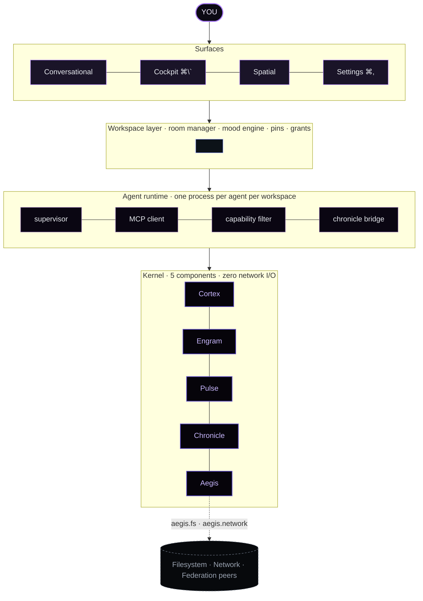

<div align="center">

<a href="https://github.com/AllStreets/ONEXUS"></a>

### The operating system for agents.

*Local-first. Sovereign. Built so the kernel never touches the network — and there's a static test that proves it.*

&nbsp;

<a href="https://github.com/AllStreets/ONEXUS/releases/tag/v1.0"></a>
<a href="https://github.com/AllStreets/ONEXUS/actions"></a>
<a href="https://github.com/AllStreets/ONEXUS-Agents"></a>
<a href="https://github.com/AllStreets/ONEXUS/blob/main/LICENSE"></a>

<a href="#quickstart"><kbd> &nbsp; <strong>Quickstart</strong> &nbsp; </kbd></a> &nbsp;
<a href="#the-four-surfaces"><kbd> &nbsp; <strong>The OS</strong> &nbsp; </kbd></a> &nbsp;
<a href="#the-safety-model"><kbd> &nbsp; <strong>Safety</strong> &nbsp; </kbd></a> &nbsp;
<a href="docs/superpowers/specs/2026-06-06-nexus-agent-os-design.md"><kbd> &nbsp; <strong>Architecture</strong> &nbsp; </kbd></a> &nbsp;
<a href="https://github.com/AllStreets/ONEXUS-Agents"><kbd> &nbsp; <strong>Agents catalog ↗</strong> &nbsp; </kbd></a>

</div>

---

<p align="center"></p>

NEXUS runs agents the way iOS runs apps. Built-in cognitive modules (Council, Specter, Wraith, Echo, …) and third-party catalog agents (aider, cline, browser-use, …) share **one runtime, one manifest, one trust model, one set of surfaces.** Workspaces are rooms with their own roster, memory, grants, and home tone. Every tool call routes through a capability arbiter that gates against the agent's declared permissions, surfaces a first-use prompt when something needs your approval, and writes every byte to an immutable audit ledger.

---

## Quickstart

```bash
# Clone + install
git clone https://github.com/AllStreets/ONEXUS.git && cd ONEXUS
python -m venv .venv && source .venv/bin/activate
pip install -e ".[llm,api,tui,messaging]"

# Configure at least one provider (or use local llama.cpp / Ollama / vLLM)
export NEXUS_OPENAI_KEY=sk-...
# export NEXUS_ANTHROPIC_KEY=sk-ant-...
# export NEXUS_DEFAULT_PROVIDER=local

# Start the OS — API + Aurora dashboard + WebSocket streams in one command
onexus serve --port 8000
```

Open **http://127.0.0.1:8000/aurora** and you're in. Press **⌘K** for workspaces · **⌘N** for new · **⌘\`** for the cockpit · **⌘,** for settings · **Esc** to close any overlay.

---

## What it does, in 30 seconds

<table>
<tr>
<td valign="top" width="33%">

#### 🜂 &nbsp; Runs agents safely

Every tool call routes through Aegis — checked against the agent's declared `network.outbound.<domain>` capability, rate-limited, and written to Chronicle. Notable / Sensitive actions raise a calm first-use prompt; you decide once.

</td>
<td valign="top" width="33%">

#### 🝢 &nbsp; Works in rooms

Workspaces own their filesystem scope, memory, agent roster, permission grants, and home tone. Switching feels like walking through a door — agents pause, mood transitions, pins activate.

</td>
<td valign="top" width="33%">

#### ⌖ &nbsp; Stays yours

The kernel makes **zero** direct network I/O — enforced by a static test, not by policy. All outbound traffic flows through `aegis.network()`. Your conversation, memory, and audit log live in one SQLite file on your machine.

</td>
</tr>
</table>

---

## The four surfaces

Aurora — the new dashboard — lives at `/aurora`. Eight ambient mood meshes drift behind every view; the body class follows the kernel's current state. The classic dashboard at `/dashboard` is preserved for backward compatibility.

| | Surface | Open with | What you do here |
|---|---|---|---|
| ⌬ | **Conversational** | default | Type to NEXUS in plain English. Cortex routes to the right agent; attribution shows what it picked and why. |
| ⌘ | **Workspaces switcher** | `⌘K` | Tile grid of every room, each in its home tone (indigo · magenta · sage · plum · amber). Click to enter. |
| ⌗ | **Cockpit** | `⌘\`` | Observability overlay — live Pulse waveform, trust gradient, last route trace, Chronicle tail, network gateway. |
| ⌑ | **Spatial** | header | Catalog grid — system + installed agents in one space, each with a bespoke identity glyph and trust ring. |
| ⌥ | **Settings** | `⌘,` | General · Workspaces · Agents · Security · Providers · About. |

> *Every glyph is custom SVG. **Zero emojis** — enforced by an automated invariant test.*

---

## The safety model

Four permission classes. The class decides who asks, how often, and what happens on trust collapse.

```
Routine     ████████████████████  silent forever (approved at install)
Notable     ████████████████      first-use prompt → auto-grants at Executor (≥0.75 trust)
Sensitive   ████████              first-use prompt + 30-day re-confirm
Privileged  ████                  Settings → Security only — never automatic
```

When an agent reaches for a Notable / Sensitive capability for the first time, a card slides in *inside* the conversation — never a blocking modal:

<details>
<summary><strong>See what a first-use prompt looks like</strong></summary>

```
┌─────────────────────────────────────────────────────────┐
│  ◐  aider wants  fs.write.workspace                     │
│      in payments-redesign / src/auth/rotate.py          │
│                                                Notable  │
├─────────────────────────────────────────────────────────┤
│  + async def callback(req):                             │
│  +     try:                                             │
│  +         return await handle(req)                     │
│  …                                                      │
├─────────────────────────────────────────────────────────┤
│  [  Allow once                                       ]  │
│  [  Always in Client work                            ]  │
│  [  Always for aider, everywhere                     ]  │
│  [  Don't allow                                      ]  │
└─────────────────────────────────────────────────────────┘
```

Allow → call resumes. Always-in-workspace → grant lands durably in `aegis.db`, scoped to that room. Always-everywhere → global. Don't allow → `PermissionDenied` raised before any side effect.

</details>

Trust is a **float**, not a flag. Correct outcomes earn `+0.12`; failures lose `−0.22`. Asymmetric on purpose: easy to lose, hard to earn. Trust below 0.50 instantly revokes every auto-grant for that agent across every workspace.

---

## Local-first, by static invariant

> *"The kernel never touches the network."*

```bash
$ pytest tests/inference/test_phase_6_smoke.py::test_kernel_never_directly_imports_httpx_in_kernel_modules
PASSED
```

This test scans `nexus/kernel/*.py` and fails CI if any module other than Aegis imports `httpx`, `urllib`, or `requests`. The promise survives refactors because the test outlives the prose.

All outbound HTTP — LLM providers, federation peers, anything else — flows through `aegis.network()`, which gates on the agent's declared `network.outbound.<domain>` capability, rate-limits per agent (60 rpm default), and logs `{agent, url, method, status, bytes_in, workspace_id, ts}` to Chronicle.

---

## Built-in agents — ten ship in the box

Each has a unique geometric SVG glyph in a tone-coloured gradient disc with a trust ring drawn around it. System agents and third-party catalog agents share the same visual language in the Spatial grid — they're siblings, not separate species.

<table>
<tr>
<td valign="top" width="50%">

#### Cognitive

| Slug | Role |
|---|---|
| `council` | Four-lens deliberation (ethical, verification, lateral, synthesis) |
| `specter` | Adversarial red-team review |
| `autonomic` | Earned-autonomy routines |
| `oracle` | Anticipatory pattern detection |
| `legacy` | Knowledge crystallization |

</td>
<td valign="top" width="50%">

#### Reflective + orchestration

| Slug | Role |
|---|---|
| `consciousness` | Self-reflection, journaling |
| `sentry` | Cognitive load / flow detection |
| `wraith` | Ephemeral sub-agents with death clocks |
| `echo` | Behavioural fingerprinting (the only built-in with a Privileged grant) |
| `agents` | Catalog dispatcher → ONEXUS-Agents |

</td>
</tr>
</table>

---

## Compared to other agent frameworks

| | NEXUS | LangChain / LlamaIndex | AutoGen / CrewAI | Ollama |
|---|---|---|---|---|
| **OS metaphor** (workspaces, surfaces, install lifecycle) | ◆ | — | — | — |
| **Unified runtime** for built-ins + third-party agents | ◆ | — | partial | — |
| **Capability gating** on every tool call | ◆ | — | — | — |
| **First-use prompt** UX with durable grants | ◆ | — | — | — |
| **Zero-network-kernel invariant** (static-tested) | ◆ | — | — | local model serving only |
| **Ambient mood UI** wired to kernel state | ◆ | — | — | — |
| **Multi-provider routing** at runtime | ◆ | ◆ | ◆ | local |
| **Immutable audit ledger** | ◆ | — | — | — |
| Production-ready in v1 | 1075 tests passing | yes | yes | yes |

NEXUS isn't a library — it's a host. LangChain composes calls inside one Python process; NEXUS runs each agent as its own process, gates its filesystem and network, partitions its memory, and gives you a surface to see what it's doing.

---

## Agents

```bash
onexus agent list                                # installed
onexus agent install <manifest.json> [--dry-run] # preview the install plan
onexus agent uninstall <slug> [--yes]
```

`--dry-run` shows the **install plan** — exactly what the agent will be able to do, grouped by class — before any state lands on disk. No legalese, no 12-item entitlements list, no surprises.

<details>
<summary><strong>The v1 manifest format</strong></summary>

Every agent (built-in or third-party) declares the same shape:

```jsonc
{
  "manifest_version": 1,
  "slug": "aider",
  "name": "aider",
  "tagline": "Pair-programming in your terminal, git-aware.",
  "version": "0.74.0",
  "system": false,
  "publisher": { "type": "org", "handle": "Aider-AI" },
  "category": "coding",
  "license": "Apache-2.0",

  "identity": {
    "mark": { "kind": "svg", "path": "./icon.svg",
              "gradient": ["#9aa8ff", "#4d5bcf"] }
  },

  "intents": [
    { "name": "CODE",
      "patterns": ["edit", "refactor", "fix.*bug"],
      "semantic_signals": ["fix this", "edit this file"],
      "weight": 1.0 }
  ],

  "capabilities": {
    "tools": [
      { "name": "edit_file",   "class": "Notable",
        "scope": "fs.write.workspace" },
      { "name": "run_command", "class": "Sensitive",
        "scope": "process.shell" }
    ],
    "declared": {
      "Routine":    ["fs.read.workspace"],
      "Notable":    ["fs.write.workspace", "network.outbound.openai.com"],
      "Sensitive":  ["process.shell"],
      "Privileged": []
    }
  },

  "runtime": {
    "transport": "stdio",
    "command":   "aider-mcp",
    "args":      [],
    "env_keys":  ["OPENAI_API_KEY"]
  },

  "trust": { "floor": 0.55, "default_tier": "ADVISOR" }
}
```

Cortex reads `intents`. Aegis reads `capabilities`. The runtime reads `runtime`. The surfaces read `identity`. One document, four readers — no schema drift. JSON Schema: [`nexus/schemas/manifest.v1.json`](nexus/schemas/manifest.v1.json).

</details>

---

## Architecture

<details>
<summary><strong>Four layers · each only talks to its neighbours</strong></summary>



**Aegis is the only kernel component that touches the network.** A static test scans `nexus/kernel/*.py` and fails CI if any other module imports `httpx`, `urllib`, or `requests`. The local-first promise isn't policy — it's an invariant.

</details>

<details>
<summary><strong>The eight moods</strong></summary>

| | Mood | Hue family | Drift | Triggers |
|---|---|---|---|---|
| ⬡ | **Calm Focus** | indigo / violet / warm amber | 24s | Default — nothing demanding attention |
| ⬡ | **Deep Flow** | jewel green / pine / oceanic | 38s | Sustained focus from Sentry |
| ⬡ | **Routing** | electric magenta / cyan / indigo | 14s | High pulse rate, multiple agents working |
| ⬡ | **Deliberating** | amber / bronze / burgundy / cream | 30s | Council, Specter, or Legacy is active |
| ⬡ | **Creative** | hot coral / tangerine / magenta + teal edge | 20s | Generative agents resident |
| ⬡ | **Reflective** | near-monochrome plum + rose ember | 42s | Consciousness module, late hour, low pulse |
| ⬡ | **Watchful** | brass / olive / slate / ember | 12s | Oracle flagged a pattern, trust sliding |
| ⬡ | **Alert** | crimson / coral / ember | 7s | Trust collapse, breach, permission denial — *sacred, used only when it matters* |

Trust events layer a 1.5s temperature wash on top of the mood without replacing it: **warm gold** rising, **cool steel** falling, **hot crimson** collapse.

</details>

---

## Workspaces

```bash
onexus workspace new <id> --name "Client work" --template coding   # or design · research · writing · personal · blank
onexus workspace list
onexus workspace switch <id>
onexus workspace destroy <id> --yes
```

Each room owns **six things, in isolation:** filesystem roots · resident agents · memory partition (its own SQLite Engram) · permission grants · home tone + mood biases · routing pins (`intent → preferred agent`). Switching rooms with `⌘K` pauses the old room's agents (`SIGSTOP` for external subprocesses, a flag for in-process), animates the mesh to the new home tone, and loads the new pins into Cortex.

---

## Documentation

- **[Architecture spec](docs/superpowers/specs/2026-06-06-nexus-agent-os-design.md)** — the design that drove v1 (730 lines, every decision)
- **[Phase docs](docs/agents/)** — Foundation · Workspaces · Safety UX · Surfaces · Network Gateway
- **[Release notes v1.0](docs/RELEASE_NOTES_v1.md)** — phase-by-phase summary
- **[Agents catalog ↗](https://github.com/AllStreets/ONEXUS-Agents)** — sibling repo: 7,000+ discoverable agents, 660+ runnable via MCP

---

## License

**Apache-2.0.** Use it, fork it, ship it. The core will always be open. Each catalogued third-party agent retains its own upstream license — see the `license` field on every manifest.

<div align="center">

&nbsp;

<sub>
  Built by <a href="https://github.com/AllStreets">Connor Evans</a> · Designed in a single brainstorming session against the spec at <code>docs/superpowers/specs/2026-06-06-nexus-agent-os-design.md</code>, then built across seven phases.
</sub>

&nbsp;

<sub>
  <a href="https://github.com/AllStreets/ONEXUS">parent</a> · <a href="https://github.com/AllStreets/ONEXUS-Agents">catalog</a> · <a href="https://github.com/AllStreets/ONEXUS/issues">issues</a> · <a href="https://github.com/AllStreets/ONEXUS/releases">releases</a>
</sub>

</div>
