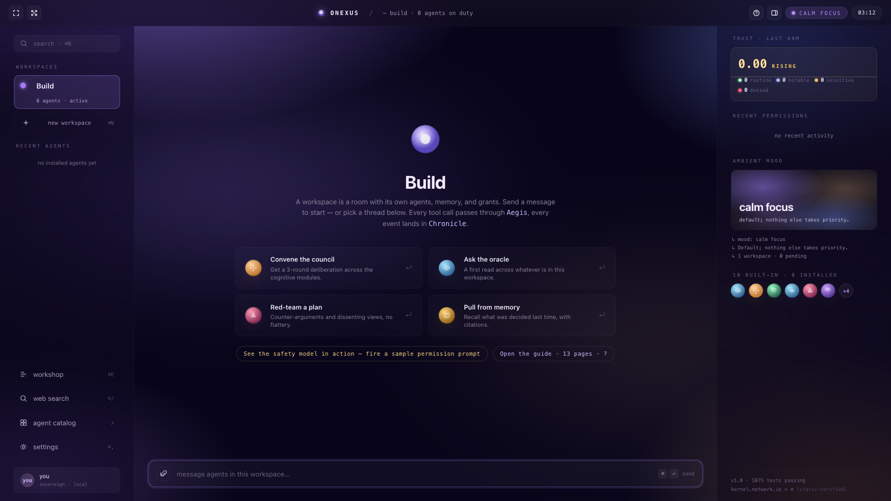
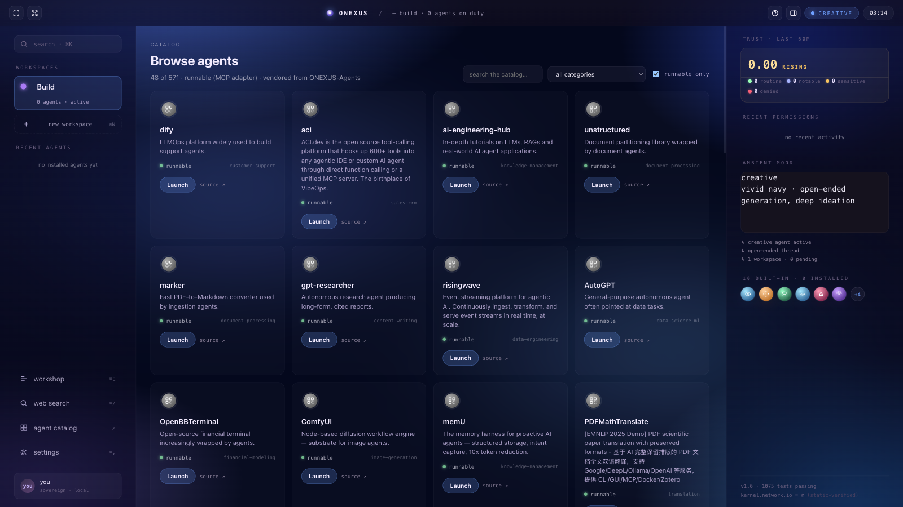
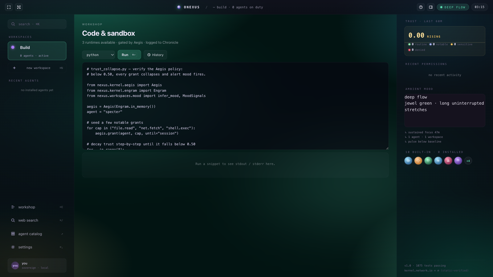
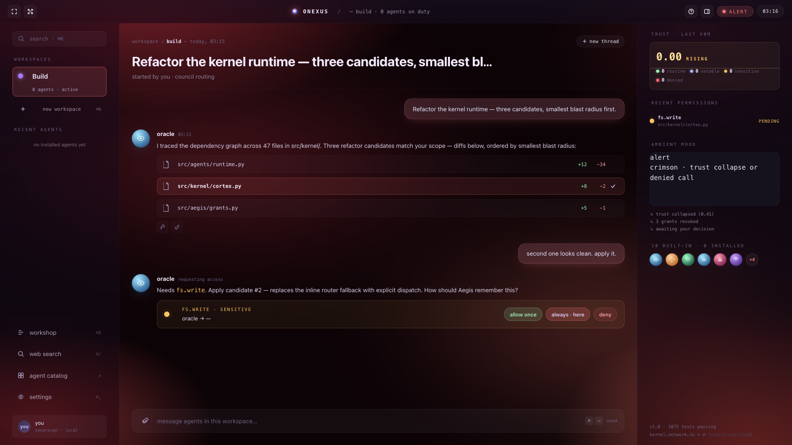
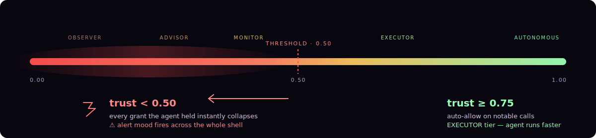
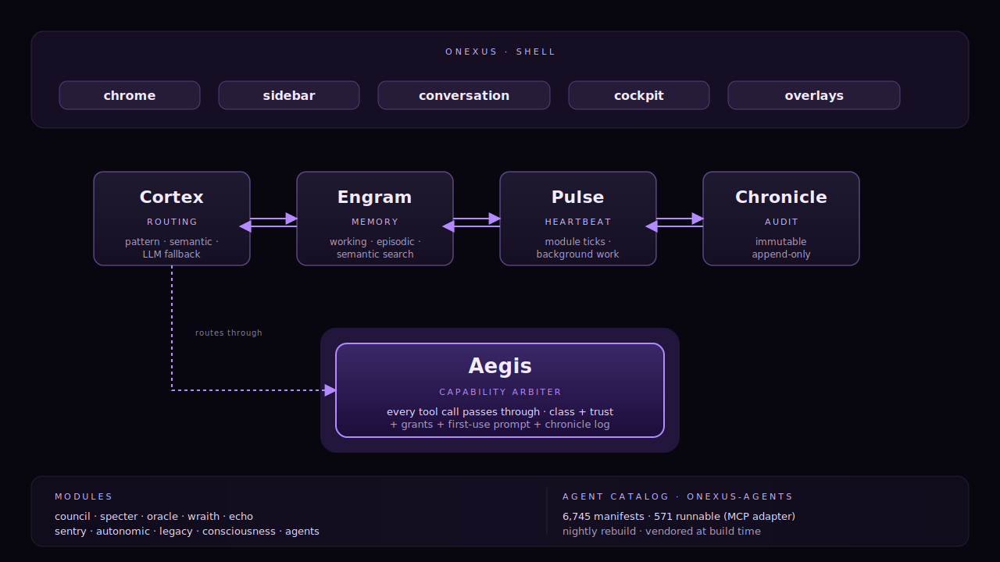

<div align="center">



&nbsp;

<a href="https://github.com/AllStreets/ONEXUS/releases/tag/v1.0"></a>
<a href="https://github.com/AllStreets/ONEXUS/actions"></a>
<a href="https://github.com/AllStreets/ONEXUS-Agents"></a>
<a href="https://github.com/AllStreets/ONEXUS-Agents"></a>
<a href="https://github.com/AllStreets/ONEXUS/blob/main/LICENSE"></a>

&nbsp;

<a href="#quickstart"><kbd> &nbsp; <strong>Quickstart</strong> &nbsp; </kbd></a> &nbsp;
<a href="#the-shell"><kbd> &nbsp; <strong>The Shell</strong> &nbsp; </kbd></a> &nbsp;
<a href="#the-safety-model"><kbd> &nbsp; <strong>Safety</strong> &nbsp; </kbd></a> &nbsp;
<a href="#built-in-agents"><kbd> &nbsp; <strong>Agents</strong> &nbsp; </kbd></a> &nbsp;
<a href="#deploy"><kbd> &nbsp; <strong>Deploy</strong> &nbsp; </kbd></a> &nbsp;
<a href="https://github.com/AllStreets/ONEXUS-Agents"><kbd> &nbsp; <strong>Agents catalog ↗</strong> &nbsp; </kbd></a>

</div>

---

<p align="center">
  
</p>

<p align="center"><em>One process. Local-first. Five-component kernel. Every tool call gated by Aegis. Every event logged to Chronicle. The kernel never touches the network — there's a static test that proves it.</em></p>

---

## What this is

**ONEXUS runs agents the way iOS runs apps.** Built-in cognitive modules (Council, Specter, Wraith, Echo, Oracle, Legacy, Consciousness, Sentry, Autonomic, Agents-dispatcher) and **6,745 third-party agents** from [ONEXUS-Agents](https://github.com/AllStreets/ONEXUS-Agents) — **571 with MCP adapters** — share one runtime, one manifest, one trust model, one set of surfaces.

A workspace is a room: it owns its own agents, memory, file grants, and home tone. Every tool call routes through a **capability arbiter** that gates against the agent's declared permissions, surfaces a first-use prompt when something needs your approval, and writes every byte to an immutable audit ledger.

You don't leave the OS to do anything. Code editor, web search, file drop, mood-driven atmosphere, agent capability sheets — all in-shell.

---

## Quickstart

```bash
# Clone + install (Python 3.11+)
git clone https://github.com/AllStreets/ONEXUS.git && cd ONEXUS
python -m venv .venv && source .venv/bin/activate
pip install -e ".[llm,api,tui,messaging]"

# Start the OS — API + Aurora dashboard + WebSocket streams in one command
onexus serve --port 8000
```

Open **http://127.0.0.1:8000/aurora** and you're in. First-time visitors get a **13-page guided tour**; hit `?` any time to re-open it.

### Local LLM (recommended — keeps you sovereign + offline)

The kernel ships with **Ollama** as the default inference provider. Install it once and ONEXUS picks it up automatically — no API keys, no outbound traffic, no rate limits.

```bash
# macOS
brew install --cask ollama         # or grab the .dmg from ollama.com
ollama serve &                      # daemon on localhost:11434
ollama pull llama3.1:8b             # ~5 GB · M-series default
# Smaller models that still work well:
#   ollama pull llama3.2:3b         # ~2 GB · 8 GB Macs
#   ollama pull qwen2.5:14b         # ~9 GB · better reasoning
```

ONEXUS auto-detects Ollama at boot — the Cortex routes natural-language questions through it, every catalog agent gets the LLM in its context, and Aegis still gates every tool call. No knobs to flip.

### Cloud provider (optional override)

```bash
export NEXUS_OPENAI_KEY=sk-...
# or
export NEXUS_ANTHROPIC_KEY=sk-ant-...
export NEXUS_DEFAULT_PROVIDER=openai   # or anthropic / local / ollama
```

### Keyboard shortcuts

```
⌘K   workspace switcher           ⌘E   workshop (code + sandbox)
⌘N   new workspace                ⌘/   web search
⌘0   expanded cockpit             ⌘P   settings
⌘⏎   send message                  ?   open the guide
```

### Footprint

| Component | Disk | RAM |
|---|---|---|
| Cloned repo (no build) | ~20 MB | — |
| Python kernel + Aurora server | — | ~100 MB |
| Standalone `.app` (Tauri shell) | 12 MB | ~150 MB (WebView2 / WKWebView) |
| Ollama daemon | 550 MB | ~60 MB |
| `llama3.1:8b` model loaded | 5 GB | **6–10 GB** (default 8k context) |
| `llama3.2:3b` model loaded | 2 GB | **3–4 GB** |

**Practical minimum**: 8 GB Mac with `llama3.2:3b` and the cockpit-only build; **comfortable**: 16 GB with `llama3.1:8b`; **headroom**: 32 GB+ for larger models and big context windows.

---

## What it does, in four pictures

The whole shell **shifts color with what's happening**. Aegis observes the kernel — CPU, engram activity, trust events, time of day — and the ambient mesh, the active workspace pill, the composer focus ring, the launch buttons, the capability sheet edge **all recolor together**.

<table>
<tr>
<td width="50%"></td>
<td width="50%"></td>
</tr>
<tr>
<td align="center"><strong>calm focus</strong> · violet · default, low load</td>
<td align="center"><strong>creative</strong> · vivid navy · open-ended ideation</td>
</tr>
<tr>
<td width="50%"></td>
<td width="50%"></td>
</tr>
<tr>
<td align="center"><strong>deep flow</strong> · jewel green · long uninterrupted stretches</td>
<td align="center"><strong>alert</strong> · crimson · trust collapse or denied call</td>
</tr>
</table>

Eight palettes total: calm focus · deep flow · routing · deliberating · creative · reflective · watchful · alert. Pick one manually from the chrome's mood pill, or let the kernel pick from observations.

---

## The shell

Aurora is a **persistent three-column workspace** — sidebar, conversation, cockpit. Glass chrome. macOS-style traffic lights that actually work (red closes the tab, yellow toggles focus mode, green toggles fullscreen).

<details>
<summary><strong>Sidebar</strong> — workspaces, recent agents, in-OS tools, user footer</summary>

- Workspace pills with **25 color tones** to pick from on create — indigo · violet · lavender · cobalt · sky · ocean · teal · mint · sage · emerald · lime · amber · honey · tangerine · mocha · coral · rose · crimson · magenta · fuchsia · plum · orchid · slate · graphite
- Hover any pill → reveals a neon-red trash icon to delete that workspace
- Recent agents block — built-in identity discs with trust tier
- ⌘E workshop · ⌘/ web search · catalog · ⌘, settings
- Persistent user footer pinned at the bottom

</details>

<details>
<summary><strong>Conversation</strong> — the talk surface</summary>

- Send a message and **Cortex routes** it: pattern + semantic + structure + workspace pin + LLM fallback
- `@oracle`, `@specter`, `@council` mention any agent directly
- Drag-and-drop files anywhere on the canvas — they're stored in workspace Engram, hashed for dedup, logged to Chronicle
- Inline permission prompts for sensitive calls: allow once · always · here · deny
- Trust feedback buttons under every agent response: thumb-up = +0.12 to that agent's trust; thumb-down = −0.22
- File diff cards when an agent proposes a refactor
- Composer pinned at the bottom regardless of thread length

</details>

<details>
<summary><strong>Cockpit rail</strong> — live observability</summary>

- **TRUST · last 60 minutes** — sparkline + delta + class breakdown (routine / notable / sensitive / denied)
- **Recent permissions** — color-coded by class, with capability + target + status + time
- **Ambient mood** — mood mesh thumbnail with the kernel's current reading and contributing reasons
- **Built-in agents** — 10 identity discs, click any for the full capability sheet
- Footer: `kernel.network.io = ∅ (static-verified)` — the kernel itself never touches the network

Press <kbd>⌘ \`</kbd> for the expanded six-panel cockpit overlay.

</details>

---

## The safety model

Aegis classifies every capability into one of four classes:

| Class | Color | Behavior |
|---|---|---|
| **Routine** | jewel green | always allowed, silent forever |
| **Notable** | calm violet-blue | auto-allow at trust ≥ 0.75, otherwise prompt |
| **Sensitive** | warm amber | always prompt — allow once / always here / deny |
| **Privileged** | coral | never auto-grant — Settings → Security only |

<p align="center">
  
</p>

The kernel writes every decision to **Chronicle** (immutable append-only sqlite). The Aurora cockpit log surfaces the last N entries by class. Settings → Security shows the live trust roster — search any of the **590** Aegis-registered modules, click revoke to reset trust to 0.

---

## Built-in agents

Ten cognitive modules ship with ONEXUS. Each declares its own capabilities and trust floor.

| Agent | Glyph | What it does |
|---|---|---|
| **Council** | compass | 3-round deliberation across the cognitive modules |
| **Oracle** | eye | first-read analysis across whatever's in the workspace |
| **Specter** | warning triangle | red-team — counter-arguments and dissenting views, no flattery |
| **Wraith** | wisp | controlled forgetting — privacy hygiene, sensitive deletion |
| **Legacy** | open book | crystallized memory — recall with citations |
| **Echo** | nested arcs | mirror — restates the user's words to surface contradictions |
| **Sentry** | heartbeat | watches for runaway loops, trust drops, denied calls |
| **Autonomic** | concentric rings | autopilot — repeats approved tool chains hands-off |
| **Consciousness** | spiral | inner state — moods, regulation, salience |
| **Agents-dispatcher** | tile grid | routes to installed third-party MCP agents |

Click any disc in the cockpit to see its declared tools, permission classes, trust floor, and network reach.

---

## Architecture

<p align="center">
  
</p>

**The kernel never touches the network.** Every outbound HTTP request from any built-in module goes through `aegis.network()` which logs to Chronicle, checks the agent's `net.*` capability declaration, and runs through `AegisTransport` (a wrapped httpx client). A static invariant test enforces that no kernel module other than `aegis.py` imports `httpx` or `requests`.

---

## In-OS tools

You don't leave the OS to write code, search the web, or store files.

### Workshop · code + sandbox

Open with `⌘E`. Pick a runtime (Python · JavaScript · shell). Hit Run (`⌘⏎`). Code executes in a **subprocess sandbox**: stripped env (`ONEXUS_SANDBOX=1`), 8-second timeout, captured stdout/stderr (max 32 KB per stream), exit code + elapsed time, logged to Chronicle. History popover keeps the last 30 runs — click to reload, clear to wipe.

### Web search

Open with `⌘/`. Routes through `aegis.network()` to DuckDuckGo's instant-answer API by default (no tracking). Configure `NEXUS_BRAVE_KEY` to use Brave Search for organic results. Wikipedia is always a fallback so you never see an empty page. History popover with last 50 queries.

### File drop

Drag any file anywhere on the conversation canvas — the surface gets a mood-tinted "Drop files into this workspace" overlay. Files are stored under `<workspace_root>/.onexus/uploads/`, hashed for dedup, registered with Engram episodic memory, logged to Chronicle.

---

## Catalog

ONEXUS ships with the [AllStreets/ONEXUS-Agents](https://github.com/AllStreets/ONEXUS-Agents) catalog bundled — every entry is a single JSON manifest under `catalog/<category>/<slug>.json`. **6,745 agents** across 40 categories, **571 runnable** via MCP adapters. Browse from the sidebar's *agent catalog* link, filter by category / runnable-only / search, click Launch on any runnable card.

The catalog rebuilds nightly via a [GitHub Actions cron](.github/workflows/nightly-catalog.yml) that reads the catalog repo's head SHA and pushes a fresh Docker image to GHCR.

---

## Deploy

### Local

```bash
onexus serve --port 8000
```

Open `http://127.0.0.1:8000/aurora`. Data lives in `~/.local/share/nexus/`.

### Docker

```bash
docker build -t onexus:local .
docker run -p 8000:8000 -v $(pwd)/.data:/data onexus:local
```

### Railway (one-click)

A `railway.json` is included. From the Railway dashboard:
1. **New Project → Deploy from GitHub repo → AllStreets/ONEXUS**
2. Railway reads `railway.json` and builds with the Dockerfile
3. Add a volume mounted at `/data` for persistent workspace storage
4. Health probe is automatic via `/api/system/health`

Full guide: [`docs/DEPLOY.md`](docs/DEPLOY.md).

---

## What's verified

| Property | Mechanism |
|---|---|
| Kernel never touches network | static test on every kernel module's imports |
| Aurora ships zero emojis | regex test on every served HTML/JS/CSS asset |
| Every overlay surface has a close affordance | accessibility tests in `tests/aurora/` |
| Mood engine reacts to signals | `tests/aurora/test_mood_wiring.py` |
| Cockpit panels stay live | `tests/aurora/test_websockets.py` |
| Permission inbox round-trips | `tests/aurora/test_permissions_routes.py` |

**1014 passed, 1 skipped** at v1.0.

---

## Contribute

The catalog is the right place to add an agent — open an issue at [ONEXUS-Agents](https://github.com/AllStreets/ONEXUS-Agents) with the agent's repo URL and a one-liner. The nightly pipeline does the rest.

For kernel / Aurora work, the [spec](docs/superpowers/specs/2026-06-06-nexus-agent-os-design.md) is the source of truth. Plans live under `docs/superpowers/plans/`.

---

## License

**Apache-2.0.** Copyright 2026 Connor Evans.

The ONEXUS kernel, Aurora dashboard, modules, agents, and standalone Tauri shell in this repository are released under the Apache License 2.0 — free for commercial and non-commercial use, including the patent grant. Each bundled catalog agent retains its own upstream license; see the `license` field on every entry in [ONEXUS-Agents](https://github.com/AllStreets/ONEXUS-Agents).

Full text at [LICENSE](LICENSE).

---

<div align="center">

<sub><strong>ONEXUS</strong> — an operating system for agents.</sub>

<sub><a href="https://github.com/AllStreets/ONEXUS">github.com/AllStreets/ONEXUS</a> &nbsp;·&nbsp; <a href="https://github.com/AllStreets/ONEXUS-Agents">parent catalog</a> &nbsp;·&nbsp; <a href="https://github.com/AllStreets/ONEXUS/issues">issues</a></sub>

</div>
